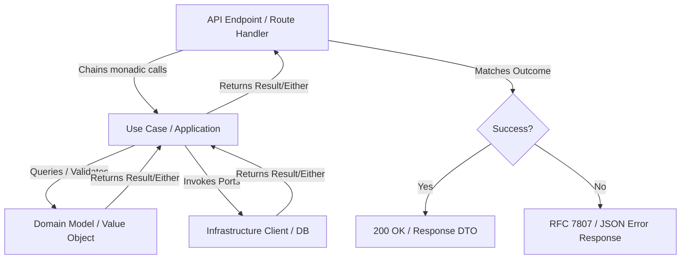

# Python Architecture & Project Structure Guide

This document outlines the architectural patterns, folder structures, and import guidelines across Python projects, adapting Clean Architecture and DDD principles to Pythonic conventions.

---

## 1. Architectural Overview

The codebase is built on **Clean Architecture** and **Domain-Driven Design (DDD)** principles, combined with a **Functional Programming (FP)** paradigm. We model operations and handle errors using monads (typically `Result[ValueType, ErrorType]` or `Either[ErrorType, ValueType]` using libraries like `returns` or a custom container).

### Monadic Control Flow
Instead of raising exceptions for expected business errors or returning `None`, operations return a monadic result. This ensures:
- Safe, type-checked error handling.
- Linear execution pipelines using functional chaining (e.g., `.bind()`, `.map()`).
- Clear separation of happy-path logic and error translation.

#### Core Rules:
1. **No Exceptions for Control Flow**: Do not raise exceptions to handle expected errors or control flow in production code. Use the monadic `Result` or `Either` type exclusively. The **only** exception is inside the test package within Test Data Builders/Factories, which may raise exceptions when unable to construct a valid test object.
2. **Ports Return Monads**: All Port interfaces (e.g., Repositories, HTTP clients, Event publishers) must return a `Result` or `Either` to explicitly model operations that can fail.



---

## 2. Directory Layout & Feature Slicing

Python packages use `lower_snake_case` naming conventions according to PEP 8. Code is organized strictly by feature/domain subdomain, using Clean Architecture layers and Vertical Feature Slicing.

### 2.1 Bounded Context Folder Structure
To maximize maintainability and keep files small, the project uses a `[bounded_context]/[action]/[layer]` structure rather than grouping layers at the Bounded Context root:

├── src/                             # All production source code
│   ├── common/                      # Shared package containing core domains (formerly Common)
│   │   └── [domain_subdomain]/      # e.g., order_processing, billing
│   │       └── [bounded_context]/    # e.g., users, invoices
│   │           └── [action]/        # e.g., register, process_payment
│   │               ├── domain/      # Pure domain logic (no external dependencies)
│   │               │   ├── models/  # Entities and Value Objects (dataclasses/Pydantic)
│   │               │   └── ports/   # Abstract Base Classes (ABCs) or Protocols
│   │               ├── application/ # Orchestrates domain actions
│   │               │   ├── contracts/ # Use case contracts (ABCs/Protocols) and Commands/Requests
│   │               │   └── use_cases/ # Application logic, workflows, & command/query handlers
│   │               └── infrastructure/ # Framework-specific implementations
│   │                   ├── http/    # API clients calling external systems
│   │                   ├── cache/   # Caching layers
│   │                   └── settings/ # Settings and dependency injection config
│   │
│   ├── internal_web/                # Web API Gateway project (formerly DomainProject.Internal.Web)
│   │   ├── routes/                  # Route definitions / controllers
│   │   │   └── v[number]/           # API Versioning (e.g., v1, v2)
│   │   │       └── [bounded_context]/ # Grouped by bounded context
│   │   │           └── [action].py  # Single-route/handler modules
│   │   ├── Dockerfile               # Container definition for internal_web
│   │   └── main.py
│   │
│   └── internal_worker/             # Background processing / Event consumers (formerly DomainProject.Internal.Worker)
│       ├── consumers/
│       │   └── v[number]/           # Message brokers / event consumers
│       ├── Dockerfile               # Container definition for internal_worker
│       └── main.py
│
└── tests/                           # All test code (formerly Common.Test, etc.)
    ├── common/                      # Mirrors 'src/common' package layout
    │   └── [domain_subdomain]/
    │       └── [bounded_context]/
    │           └── [action]/
    │               ├── domain/
    │               │   ├── models/  # Unit tests for domain models
    │               │   └── builders/ # Test data builders/factories (can raise exceptions)
    │               ├── application/
    │               │   └── use_cases/ # Unit tests for application use cases
    │               └── infrastructure/ # Integration and client tests
    │
    ├── internal_web/                # Integration and routing tests for internal_web
    └── internal_worker/             # Integration and messaging tests for internal_worker
```

### 2.2 Web API Endpoints & Routes
- **Single Responsibility (REPR pattern)**: Keep route handler modules focused. Each file in `routes/v[number]/[bounded_context]/[action].py` should represent a single conceptual operation.
- **Naming Convention**: Directory names and files must be `lower_snake_case` (e.g., `routes/v1/users/register.py`).

### 2.3 Dependency Injection & Configuration Encapsulation
- **DI via Functions/Decorators**: Use Pythonic dependency injection patterns (e.g., FastAPI `Depends`, dependency-injector containers, or constructor injection).
- **Clean main.py**: Programmatic setup and DI container initialization should be encapsulated in helper modules/functions. Do not register individual services or parse settings directly in the high-level `main.py`.

### 2.4 Application Contracts & Commands
- **Contracts Folder**: Create a `contracts/` directory inside the application layer (`application/contracts/`) to contain the use case interfaces.
- **Single Interface per File**: Define each interface (using `abc.ABC` or `typing.Protocol`) in its own dedicated module (e.g., `register_user.py`).
- **Command Positioning**: Define the DTO, Command, or Request (using `dataclasses.dataclass` or Pydantic `BaseModel`) associated with the use case contract directly within the same file, positioned immediately below the contract interface definition.

---

## 3. Module Import Rules

Imports must follow PEP 8 styling and maintain strict layering boundaries:
- **Absolute Imports**: Always use absolute imports matching the package structure under `src/` (or relative imports when appropriate).
  - *Example:* `from src.common.billing.users.register.domain.models import User`
- **Dependency Flow**: Higher layers can import from lower layers (e.g., `infrastructure` imports from `application` and `domain`), but lower layers (e.g., `domain`) must **never** import from higher layers (`application`, `infrastructure`, or `internal_web`).

---

## 4. Containerization & Docker Setup (Modular Monolith)

Since the repository operates as a modular monolith, each deployable application module (e.g., `internal_web`, `internal_worker`) is represented by its own `Dockerfile` placed directly inside its project folder.

### Rules for Docker Configuration:
1. **Dockerfile Placement**: Place the `Dockerfile` inside the root of the deployable module's folder:
   - `src/internal_web/Dockerfile`
   - `src/internal_worker/Dockerfile`
2. **Build Context**: Always execute the `docker build` command from the **repository root** (not the module directory) to ensure the build context includes the shared `common` module under `src/common/`.
   *Example:*
   ```bash
   docker build -f src/internal_web/Dockerfile -t internal_web .
   ```
3. **Multi-Stage Builds & Dependency Management**: Use multi-stage builds. Install dependencies using `pipenv` inside the builder stage. Configure `PIPENV_VENV_IN_PROJECT=1` to build the virtual environment locally (under `.venv`), then copy the `.venv` folder to the runtime stage.

### Example Dockerfile (`src/internal_web/Dockerfile`):
```dockerfile
# Stage 1: Install dependencies
FROM python:3.14-slim AS builder

WORKDIR /app

RUN pip install --no-cache-dir --upgrade pip pipenv

# Copy Pipfile and Pipfile.lock first to leverage Docker layer caching
COPY Pipfile Pipfile.lock ./

# Build the virtual environment in the project directory (.venv)
ENV PIPENV_VENV_IN_PROJECT=1
RUN pipenv install --deploy

# Stage 2: Production runtime environment
FROM python:3.14-slim AS runtime

WORKDIR /app

# Copy the virtual environment from the builder stage
COPY --from=builder /app/.venv /app/.venv
ENV PATH="/app/.venv/bin:$PATH"

# Ensure Python can resolve absolute imports from /app/src
ENV PYTHONPATH=/app

# Copy shared library (common) and the specific application module
COPY src/common /app/src/common
COPY src/internal_web /app/src/internal_web

EXPOSE 8000

CMD ["python", "-m", "src.internal_web.main"]
```

---

## 5. Project Configuration & Setup Files

To maintain consistency across all repositories, every Python project must include the following standard configuration and setup files at the root directory level.

### 5.1 `.python-version`
Specifies the specific Python runtime version targeted by the project.
```ini
3.14
```

### 5.2 `Pipfile`
Defines project dependencies and development tools under Pipenv.
```toml
[[source]]
url = "https://pypi.org/simple"
verify_ssl = true
name = "pypi"

[packages]
# Production dependencies go here

[dev-packages]
assertpy = "1.1"
black = "~=22.6"
flake8 = "~=4.0"
hypothesis = "*"
isort = "~=5.8"
mypy = "*"
pytest = "~=7.1"
pytest-cov = "~=3.0"

[requires]
python_version = "3.14"
```

### 5.3 `setup.cfg`
Stores metadata and configurations for formatting, linting, and testing utilities.
```ini
[flake8]
ignore = E203, E266, E501, W503
max-line-length = 88
max-complexity = 18
select = B,C,E,F,W,T4
exclude =
    migrations
    __pycache__
    manage.py
    settings.py
    env
    .env
    ./env
    env/
    .env/
    .venv/

[isort]
profile=hug
src_paths=src,test

[mypy]
files=src,tests
ignore_missing_imports=true

[tool:pytest]
testpaths=tests

[tool.black]
include = './src/*.py'
exclude = './.*'

[run]
source = src

[report]
exclude_lines =
    pragma: no cover
    def __repr__
    if self\.debug
    raise AssertionError
    raise NotImplementedError
    if 0:
    if __name__ == .__main__.:
```

### 5.4 `Makefile`
Acts as the central command helper to automate standard project lifecycle tasks.
```makefile
PIPENV = PIPENV_IGNORE_VIRTUALENVS=1 pipenv
PIPENV_SAFE_RUN = PIPENV_DONT_LOAD_ENV=1 $(PIPENV) run
.DEFAULT_GOAL := help

.PHONY: help
help:  ## Show this help
	@grep -E '^\S+:.*?## .*$$' $(firstword $(MAKEFILE_LIST)) | \
		awk 'BEGIN {FS = ":.*?## "}; {printf "%-30s %s\n", $$1, $$2}'

.PHONY: setup
setup: .venv/lib  ## Install virtualenv dependencies
	@echo "✅ Setup it's done"

.PHONY: tests
tests:  ## Locally run tests
	$(PIPENV) clean
	$(PIPENV_SAFE_RUN) pytest --verbose

.PHONY: lint
lint:   ## Lint the project files
	@echo "🌑 Formatting with black"
	@$(PIPENV) run black ./src
	@echo "🕵 Check for errors with flake8"
	@$(PIPENV) run flake8 ./
	@echo "😋 Running isort"
	@$(PIPENV) run isort --atomic .

.PHONY: clean
clean: ## Removed venv files
	rm -rf .venv
	$(PIPENV) --rm || true
	$(PIPENV) --rm || true

.ONESHELL:
.venv/lib: Pipfile.lock
	pip install -U pipenv
	$(PIPENV) clean
	mkdir -p .venv
	$(PIPENV) install --dev
	test -d .venv/lib && touch .venv/lib

.ONESHELL:
Pipfile.lock: Pipfile
	$(PIPENV) lock
```

### 5.5 `.editorconfig`
Instructs editors and IDEs on file formatting rules (indentation style, line endings).
```ini
root = true

[*]
end_of_line = lf
insert_final_newline = true
charset = utf-8

[*.{json,py}]
indent_style = space
indent_size = 4

[*.{yml,yaml}]
indent_style = space
indent_size = 2

[Makefile]
indent_style = tab
```

### 5.6 `.gitignore`
Standard ignore rules for Python, virtual environments, coverage results, caches, and editor-specific directories.
```
*.iml
dumps/
__pycache__
.env
.venv/
.python-version

.pipenv-sync-date
.cache/
.coverage
.pytest_cache
.hypothesis/

.DS_Store
.vscode
.idea
```


